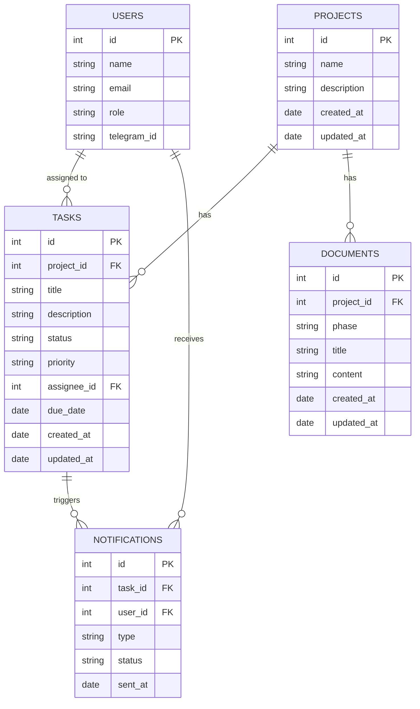

# Backend Architecture and Design Theme Guide for Rencana

## 1. Backend Architecture Overview

Rencana backend will be a RESTful API built with Next.js API routes (already scaffolded) and a database to persist data. The backend will handle:

- Project management (projects, boards, tasks)
- User management (admin and members for notifications)
- Documentation management (documents per project phase)
- Notification system integration (n8n + Telegram)
- AI integration for task description generation

### 1.1 Technology Stack

- Node.js with Next.js API routes
- Database: PostgreSQL (recommended for relational data and complex queries)
- ORM: Prisma (for type-safe database access)
- Authentication: Hardcoded admin-only access (middleware)
- Notification: n8n workflow integration with Telegram API
- AI: OpenAI API or local AI model for task description generation

---

## 2. Database Schema Design

---

## 3. API Endpoints (Summary)

- `/api/v1/projects` - CRUD for projects
- `/api/v1/tasks` - CRUD for tasks
- `/api/v1/users` - Manage members for notifications
- `/api/v1/documents` - Manage project documents
- `/api/v1/notifications` - Track notification status
- `/api/v1/ai/generate-description` - Generate task descriptions from titles

---

## 4. Authentication & Authorization

- Admin access protected by hardcoded credentials or environment variables
- No public user login; members only exist for notification purposes
- Middleware to restrict API and UI access to admin only

---

## 5. Notification System Integration

- Use n8n to create workflows that listen for task due dates and status changes
- Trigger Telegram messages to assigned members (PICs) for alerts
- Webhook endpoints to receive updates from n8n if needed

---

## 6. Design Theme Guide

### 6.1 Color Palette

| Name          | Hex       | Usage                      |
|---------------|-----------|----------------------------|
| Primary Blue  | #3B82F6   | Buttons, links, highlights |
| Secondary Gray| #6B7280   | Text, icons, borders       |
| Background    | #F9FAFB   | Page background            |
| Surface White | #FFFFFF   | Cards, modals              |
| Error Red     | #EF4444   | Error messages, alerts     |
| Success Green | #10B981   | Success messages, badges   |

### 6.2 Typography

- Font Family: "Inter", sans-serif
- Headings: Bold, sizes from 24px (h1) to 14px (h6)
- Body Text: Regular, 16px
- Line Height: 1.5 for readability

### 6.3 Spacing & Layout

- Base spacing unit: 8px
- Margins and paddings in multiples of 8px (8, 16, 24, 32)
- Consistent card and container padding

### 6.4 UI Components

- Buttons: Rounded corners (6px), primary and secondary variants
- Inputs: Clear labels, focus states with primary blue border
- Alerts: Colored backgrounds with icons for error, success, info
- Kanban Board: Draggable cards with shadow and hover effects
- Gantt Chart: Clear timeline with color-coded task bars

---

## 7. Progress Tracking (progress.md)

A progress.md file will be created in the plan-project directory to track development phases, tasks, and status updates.

---

# Summary

This plan outlines the backend architecture with a PostgreSQL database schema, API endpoints, authentication, notification integration, and a design theme guide for consistent UI styling. The next step is to implement the backend and integrate with the existing frontend components.

Please review this plan and let me know if you would like to make any changes or additions before I proceed to create the progress.md file and assist with implementation.